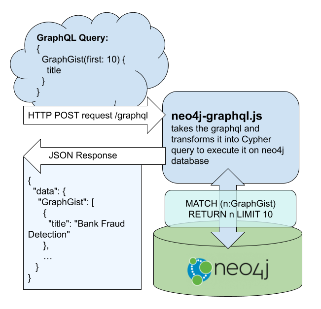

# Graphgist Portal - v3

This project was started with [GRANDstack](https://grandstack.io) (GraphQL, React, Apollo, Neo4j Database). There are two components for the portal, the [`UI application`](/ui-react) (in React) and the [`API app`](/api) (GraphQL server).

## API



## Deployment

This is currently deployed to Heroku, since this repository contains both API and UI repository we need to individually push each one, to achieve that we can create a subtree branch with only that specific folder:

Example

For API:

```
git subtree split --prefix api -b heroku-api
```

This will make the `heroku-api` branch hold only the `api` folder.

Then we can deploy our local `heroku-api` to heroku `master`:

```
heroku git:remote -r remote-api -a graphgist-portal-v3
git push -f remote-api heroku-api:master
```
